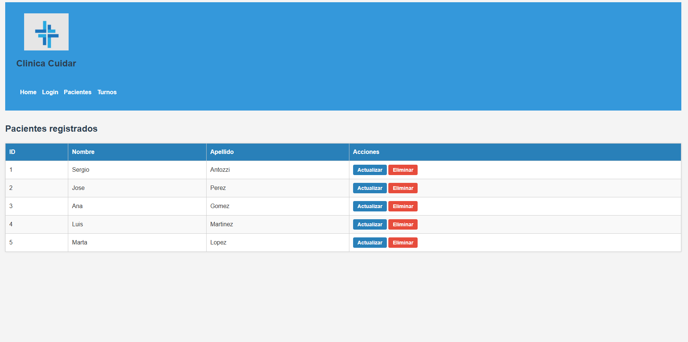

# ⛄ TP3 - Programación III

```js
const grupo13 = [
  { id: 1, nombre: "Mariano", apellido: "Romero"},
  { id: 2, nombre: "Franco", apellido: "Panzone"},
  { id: 3, nombre: "Julian", apellido: "Dantezano"},
  { id: 4, nombre: "Luciano", apellido: "Ramos Cavero"},
  { id: 5, nombre: "Marcos", apellido: "Borri"}
];
```


## Índice

- [Cómo instalar el proyecto](#cómo-instalar-el-proyecto)
- [API](#api)
  - [Endpoints - Pacientes](#endpoints---pacientes)
  - [Endpoints - Turnos](#endpoints---turnos)
- [Vistas EJS](#vistas-ejs)
- [Aclaraciones](#aclaraciones)


---

##  Cómo instalar el proyecto

1. Clonar el repositorio:

   ```bash
   git clone https://github.com/Marianoromero8/Programacion-III
   ```

2. Acceder a la carpeta del proyecto:

   ```bash
   cd Programacion-III
   cd "TP3 general"
   ```

3. Instalar Express y las dependencias:

   ```bash
   npm i
   ```

4. Correr la API:

   ```bash
   npm run dev
   ```

---

##  API

> URL base: `http://localhost:3000/api/v1/`

###  Endpoints - Pacientes

- **GET** todos los pacientes  
  ```http
  http://localhost:3000/api/v1/pacientes/
  ```

- **GET** paciente por ID  
  ```http
  http://localhost:3000/api/v1/pacientes/:id
  ```

- **POST** login (genera token)  
  ```http
  http://localhost:3000/api/v1/login
  ```

- **POST** crear paciente  
  ```http
  http://localhost:3000/api/v1/pacientes/
  ```

- **PUT** actualizar paciente  
  ```http
  http://localhost:3000/api/v1/pacientes/:id
  ```

- **DELETE** eliminar paciente  
  ```http
  http://localhost:3000/api/v1/pacientes/:id
  ```

---

###  Endpoints - Turnos

- **GET** todos los turnos  
  ```http
  http://localhost:3000/api/v1/turnos/
  ```

- **GET** turnos por ID de paciente  
  ```http
  http://localhost:3000/api/v1/turnos/:idPaciente
  ```

- **POST** crear un turno  
  ```http
  http://localhost:3000/api/v1/turnos/
  ```

- **PUT** actualizar un turno  
  ```http
  http://localhost:3000/api/v1/turnos/:id
  ```

- **DELETE** eliminar un turno  
  ```http
  http://localhost:3000/api/v1/turnos/:id
  ```

---

##  Vistas EJS

- 🏠 Home: [http://localhost:3000/](http://localhost:3000/)

- 🔐 Login: [http://localhost:3000/login](http://localhost:3000/login)

- 👥 Pacientes: [http://localhost:3000/pacientes](http://localhost:3000/pacientes)

- 📅 Turnos: [http://localhost:3000/turnos](http://localhost:3000/turnos)


---

##  Aclaraciones

- Credenciales admin para el login: Email: email@gmail.com - Password: 12345 (si se desea modificar esto o eliminarlo, vaya a la funcion validateLogin() en el modelo de pacientes)
- Variables de entorno usadas en el proyecto
```env
TEMPLATE=ejs
HOST=http://localhost
PORT=3000
SECRETE_WORD=palabra
EXPIRES_IN=24h
```

